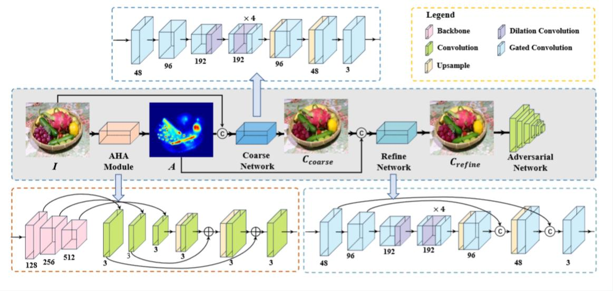

# ICASSP 2024：Highlight removal network based on an improved dichromatic reflection model

This repository is the official implementation of ICASSP 2024 paper：Highlight removal network based on an improved dichromatic reflection model.

>```
>@INPROCEEDINGS{10447916,
 > author={Hu, Kun and Huang, Zhaoyangfan and Wang, Xingjun},
>  booktitle={ICASSP 2024 - 2024 IEEE International Conference on Acoustics, Speech and Signal Processing (ICASSP)}, 
 > title={Highlight Removal Network Based on an Improved Dichromatic Reflection Model}, 
  >year={2024},
  >volume={},
 > number={},
>  pages={2645-2649},
>  keywords={Measurement;Adaptation models;Codes;Adaptive systems;Color;Signal processing;Visual effects;Specular highlight removal;Dichromatic reflection model;Coarse-to-refine network;Highlight aware},
>  doi={10.1109/ICASSP48485.2024.10447916}}
>```

## Introduction

State-of-the-art highlight removal methods still face the problems of color inconsistencies between highlight region and background, and content unreality in highlight areas. To solve these two problems, we propose a novel adaptive highlight-aware network for specular highlight removal based on an improved dichromatic reflection model. For color inconsistencies, we propose an adaptive highlight-aware (AHA) module to perceive the complete highlight information including the location and the scale of the specular highlight. Therefore, the AHA module enables the network to adaptively remove highlights while keeping non-highlight areas intact. For content unreality, we design a novel coarse-refine network to ensure that the content of the highlighted area is realistic after highlight removal. Extensive experimental results indicate that our methods can obtain excel-
lent visual effects of highlight removal and achieve SOTA results on two datasets in several quantitative evaluation metrics. Our code is available at [here](https://github.com/LittleFocus2201/ICASSP2024).




## Requirements

To install requirements:

```setup
pip install -r requirements.txt
```
## Datasets
You can download datasets Specular highlight image quadruples (SHIQ) [here](https://drive.google.com/file/d/1RFiNpziz8X5qYPVJPl8Y3nRbfbWVoDCC/view). 
 SHIQ_tiny is a small part of SHIQ that facilitates direct testing of the code that trains the model. If you want to get the full model you need to download all of SHIQ for training.


## Training

To train the model(s) in the paper, run this command:

```train
python train.py --runs_name <> --dataroot <> --train_dir <> --test_dir <>
```

Example:

```
python train.py --runs_name './myruns' --dataroot 'SHIQ_tiny' --train_dir 'train' --test_dir 'test'
```

## Evaluation

To evaluate my model on your datasets, run:

```eval
python infer.py --input_dir <> --output_dir <> -- infer_model <>
```

Example:

```eval
python infer.py --input_dir './test/inp/' --output_dir './test/out_new/' --infer_model './savedmodel/Nature.mdl'
```

## Pre-trained Models

You can download pre-trained models here [code](https://drive.google.com/drive/folders/1Y3U7mksNg0Vd0fINITKc4VQOHu5dyvPp?usp=drive_link). 

## Final Note

This code is not allowed for any commercial purpose without written concent from the authors.
